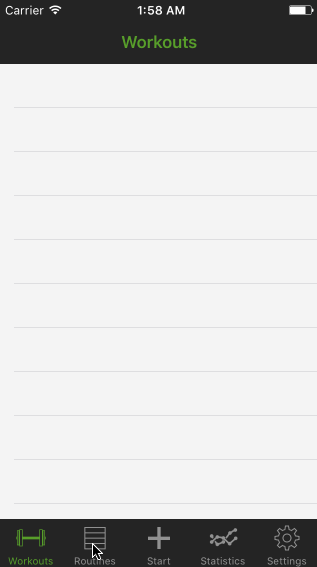

### Issues
- A lot of redundancy at the moment with view controller classes. Previously worked with a overly generic version of the implementation and the compiler would fail even given correct code. Trying to get to the point where the feature set that I desire is finished before I go back and merge redundant classes.
- Statistics tab unimplemented.
- Settings tab unimplemented.
- Git repository won't work due to reliance on local development pods.
- UI rather unpolished. Lake of proper labeling and many UI elements have no context to tell you what they are (yet).

This functionality is very raw at this point, obviously. To describe how it'll work:

* The first tab will show you a history of all your workouts that you've done.
* The second tab will show you your routines. A routine is a workout format. You set it up once and then you can use that same format whenever you'd like to start a new workout. So say you do one workout on Monday and Friday and a different one on Wednesday and Saturday, you can create two different routines and just select to start from that format every workout. If you select one of the routines, it will take you to a VC where you will be able to edit that routine.
* The third tab will be how you start a workout. The first time you click it it will bring you to a menu to choose which routine format you want your new workout to follow. You can select either from a blank routine or one of your chosen routines. If you choose one of your routines, it will fill out the workout body for you.
* The fourth tab will be statistical analysis of your workout history. IE the count of how many times you've done a particular exercise, the weight you've done and the evolution of your strength over time, etc.
* Typical settings.

The key feature, to me, is going to be customizability of the workout tracking interface. I already have a working idea of a drag and drop method to vary what your workout's log looks like. I've tried a TON of different workout tracking apps and always go back to pencil and paper becuase none of them fit my needs. This rings true for a few friends of mine as well. We all agree that everything is just too rigid. So my plan is to let you choose how detailed you want your tracking to be.

For example, I like to keep track of every time I fail to finish a set/rep. I like to take notes and keep track to remind myself. So I'd want teh cells in the Workout page to show me the results of the last time I did this exercise, my goal for today, whether or not I completed it today and, if I failed, the count of how many reps I accomplished before failing, and a note to remind myself of what happened.

My brother, however, does not care about these details. He only wants quick access to what he did last time and what he's doing today as well as a timer to track sets.

So my plan is to have all of these options drag-and-drop'able to enable/disable them. This way the user can cater the utility of the app to their needs.

